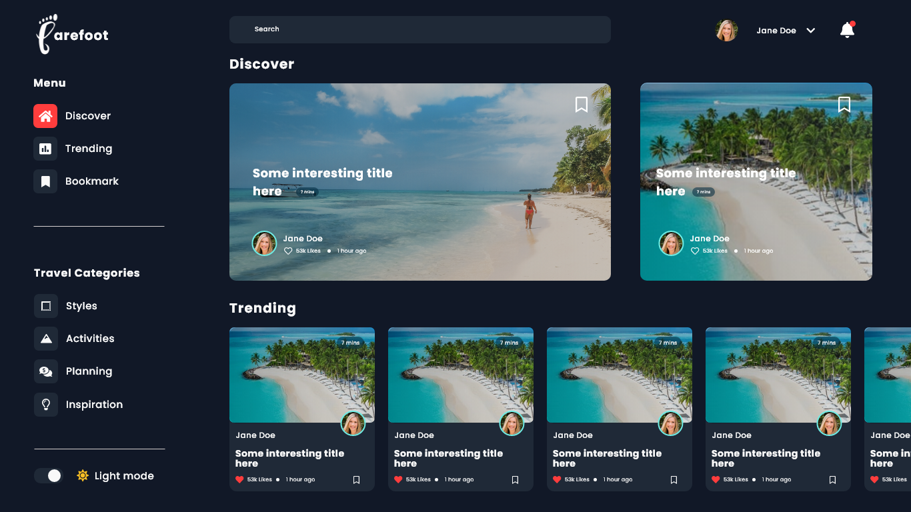
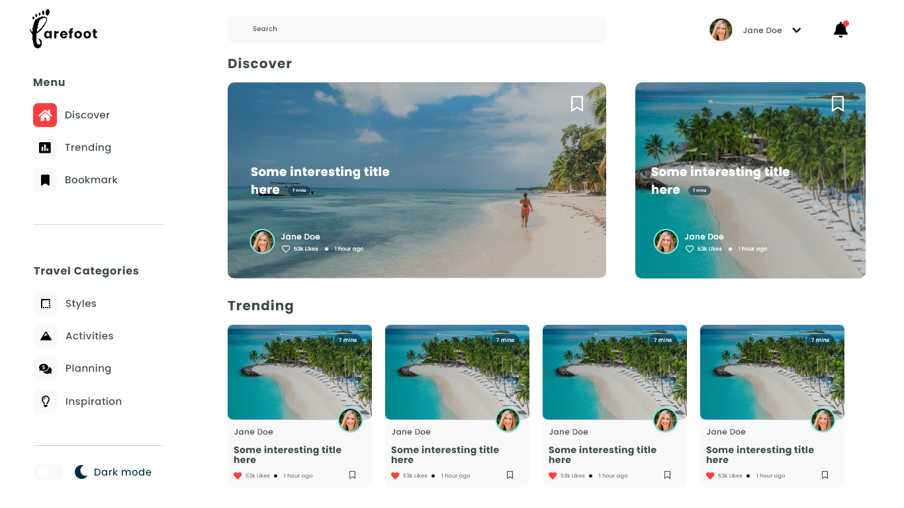

# Barefoot

    

Website Preview
https://barefootblog.000webhostapp.com/

## About Barefoot

Barefoot is a travel blog site where the entire focus is the world of travel, showcasing every beautiful place, people, culture etc. It helps those travel bloggers and vloggers share their stories and experiences in every place they visited. It allows them to share tips, guides, insights and give a review to all the places they went to.

The main target user of this web application project is basically those travel lovers as well as YouTube Travel vloggers.
Travel blogs introduce you to places, activities and adventures you didn’t even know existed. Travel bloggers are storytellers. We all need stories to expand our horizons. Yelp gives you reviews but not new ideas or experiences.

## Features

- Login and Registration with email verification
- Comment and Like System
- Categories | Tags | Bookmarks
- Trending Page
- Light mode and Dark mode
- CRUD for Travel Stories | Tips | Reviews
- Youtube Embed

## ToDo
- Add social logins | Facebook | Google | Twitter

## License

The Barefoot is an open-sourced software licensed under the [MIT license](https://opensource.org/licenses/MIT).
